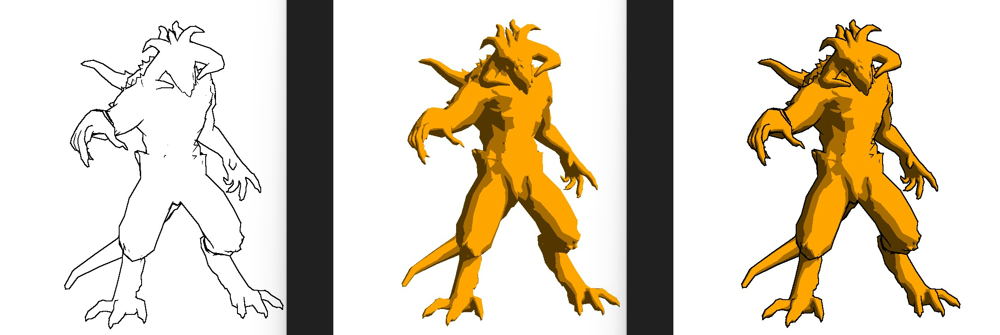
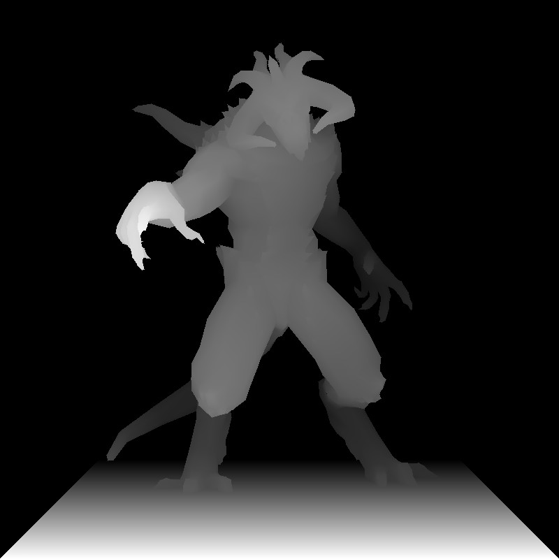
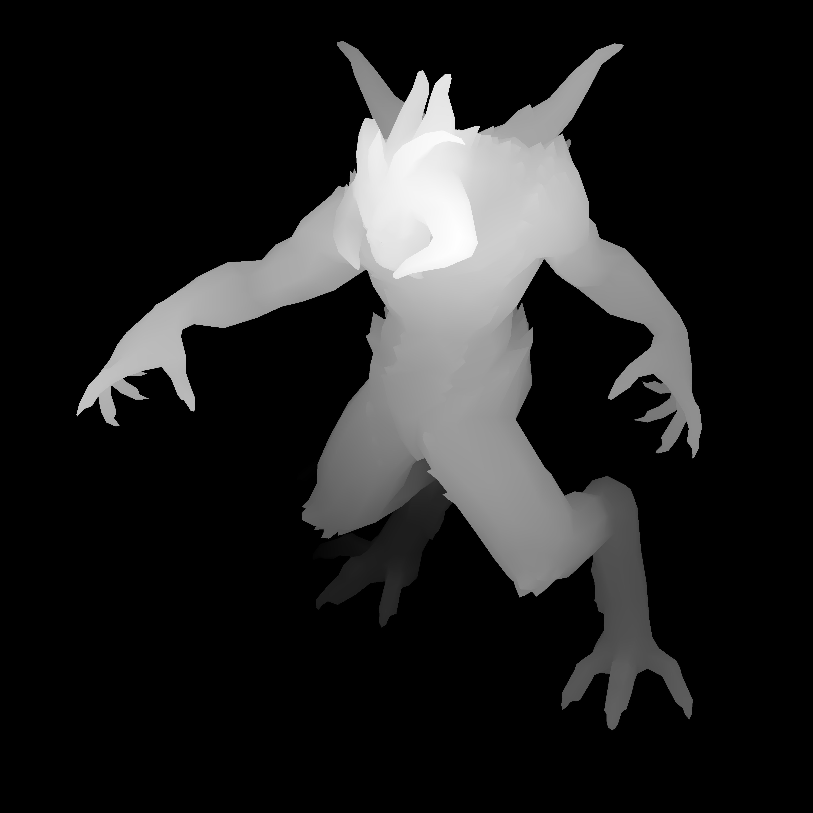
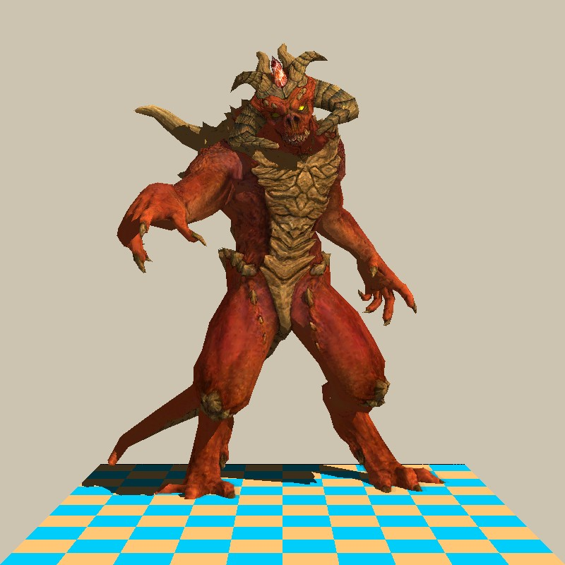
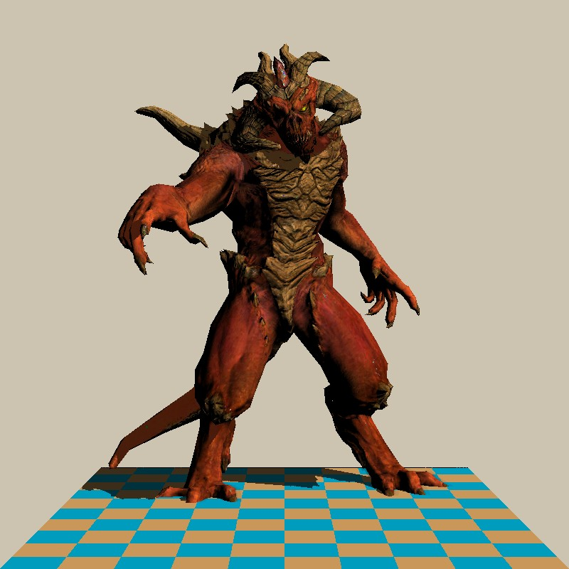
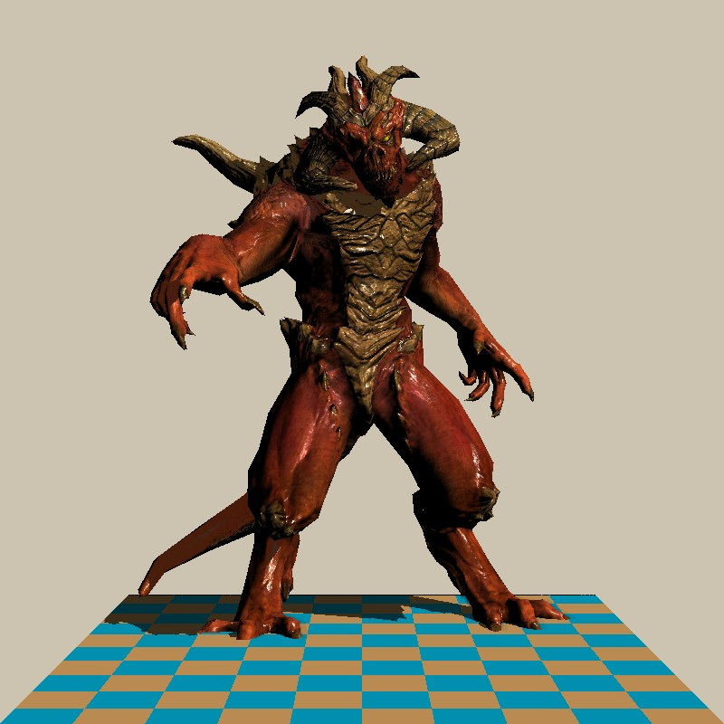
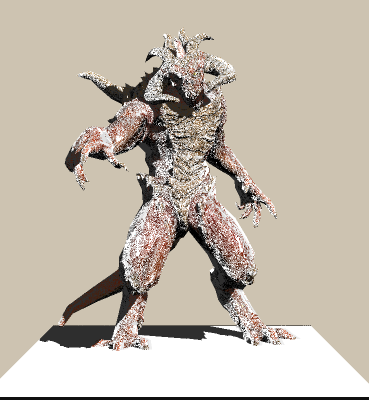
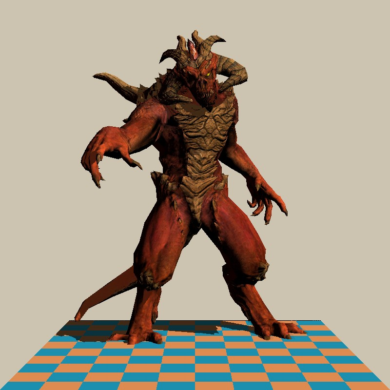
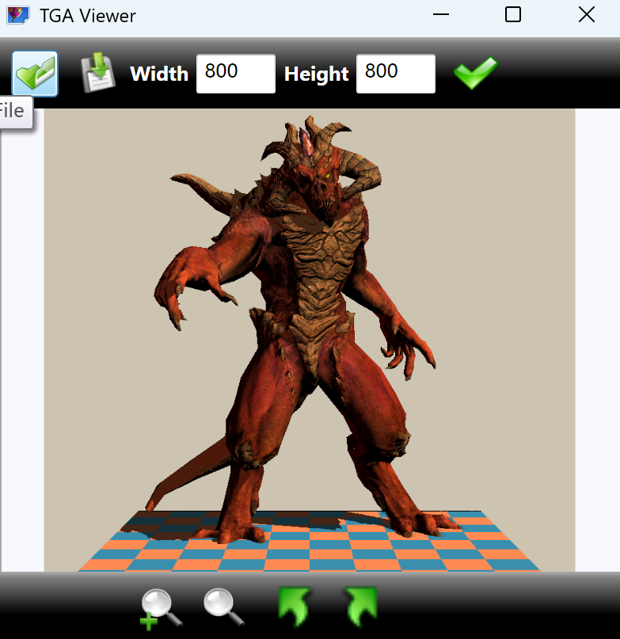
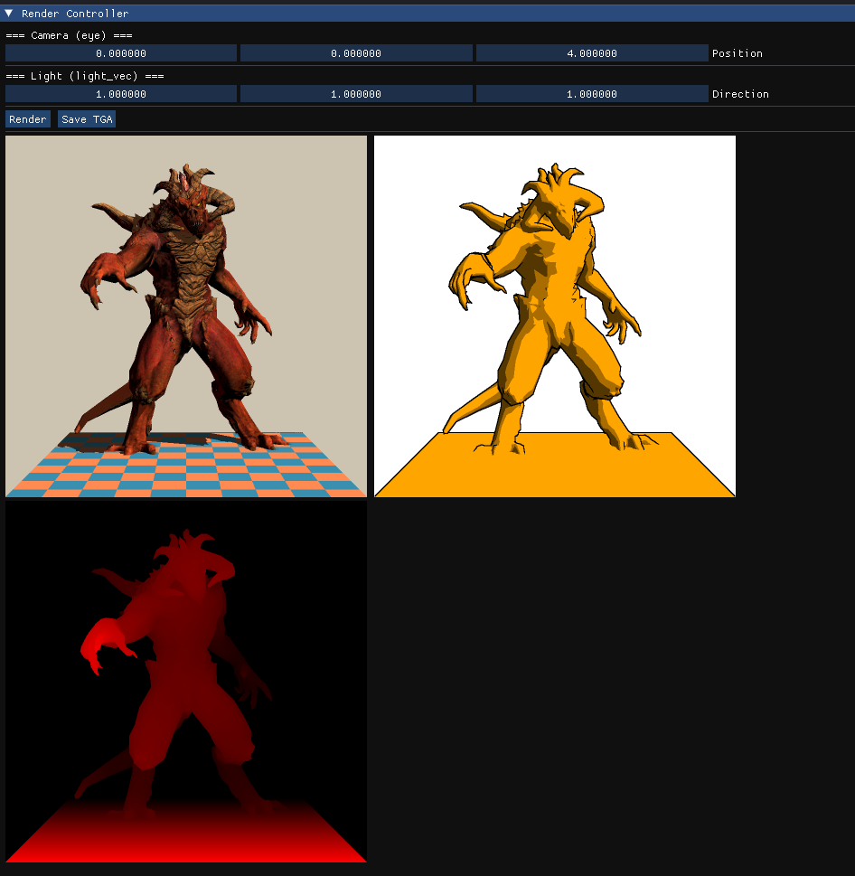

# TinyRenderer 软光栅渲染器
基于 ssloy/tinyrenderer 学习实现的纯 CPU 软光栅渲染器，完整实现 3D 渲染管线、光照模型、高级渲染效果及交互式调参界面。

## 项目介绍
本项目基于 github.com/ssloy/tinyrenderer 框架学习开发
- 复用：OBJ 模型读取、TGA 图像生成、基础向量数学运算
- 自研：完整 MVP 矩阵、三角形光栅化、Z-Buffer、光照系统、卡通渲染、阴影、SSAO、简化 PBR、IBL
- 界面：基于 GLFW + ImGui 实现交互式实时调参，告别单次生成 TGA 文件

## 核心实现
### 1. 3D 模型与 MVP 变换
- 模型读取：直接使用原作者模型文件（obj/spec/diffuse）
- 模型矩阵 M：仅旋转，忽略平移，专注渲染出图
- 视图变换 V：坐标从 [-1,1] 映射到屏幕 [0, width]
- 投影矩阵 P：简易透视公式 x/(1-z/f)，轻量化实现

### 2. 三角形光栅化
- Triangle 类：存储透视变换顶点 + 重心坐标插值
- 绘制流程：背面剔除 → 包围盒裁剪 → 优化型点-in-三角形判断
- Z-Buffer：一维数组存储深度，插值 Z 值，灰度可视化
- 关键修复：
  1. 透视矫正缺失 → 纹理方格畸变
  2. 浮点精度滥用 → 像素断裂（改用 int 离散像素）

### 3. 光照与着色模型
- Phong 模型：环境光 + 漫反射 + 镜面反射
- 卡通渲染：基础色阶 + 亮度分级 + Sobel 边缘检测
- 阴影：双 Z-Buffer 映射，判断遮挡关系
- SSAO：2D 简化版 16 方向采样，环境遮蔽效果
- 简化 PBR：无粗糙度/金属度，使用 spec 模拟，实现菲涅尔 + 能量守恒 + 微表面模型
- IBL：HDR 环境贴图 → Cubemap 映射 → 法线采样 → x/(x+1) 防曝光

### 4. 交互界面
- GLFW 窗口 + ImGui 控制面板
- 实时调整参数 + 即时渲染预览
- 支持多效果并行展示

## 效果展示

*Phong 完整光照效果*

*卡通着色 + Sobel 边缘检测*

*双 Z-Buffer 实时阴影*

*阴影实现原理*

*2D 简化版 SSAO 环境遮蔽，SSAO之后phong*

*直接默认非金属实现简化版PBR*

*缺少材质和粗糙度文件下强制用spec参数替代导致些许错误*

*HDR数值直接使用导致错误*

*利用递增函数解决曝光下的IBL方案*

*原作者的tga展示方案*

*GLFW + ImGui 交互式调参界面*

## 技术栈
- 语言：C++
- 窗口：GLFW
- 界面：ImGui
- 模型：OBJ 模型加载
- 图像：TGAImage
- 渲染：纯 CPU 软光栅化

## 项目亮点
- 从光栅化基础到高级渲染效果完整闭环
- 大量调试经验：透视矫正、深度插值、像素精度、Z-Buffer 精度
- 轻量化、无引擎依赖，适合图形学原理学习
- 交互式界面，可实时调参对比效果

## 致谢
- 基础框架：ssloy/tinyrenderer