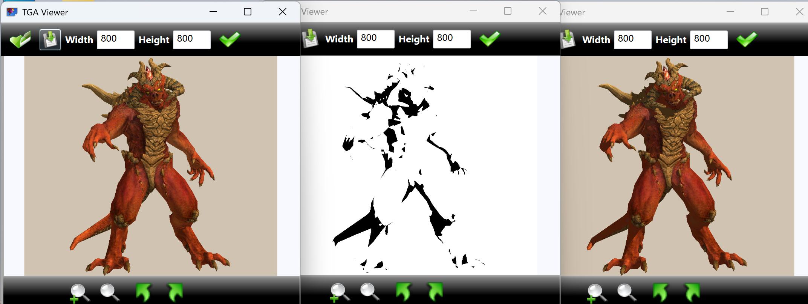

# TinyRenderer - 软光栅渲染器
独立从零实现的软件光栅化渲染器，基于经典 tinyrenderer 框架，使用纯 C++ 实现。

✨ 项目简介
本项目实现了一套完整的软件光栅化渲染管线，不依赖图形硬件 API，纯 CPU 实现三角形绘制、深度缓冲、着色器逻辑。用于图形学原理验证与实践，作为技术实践展示。

🆕 项目亮点
- 已通核心渲染管线，支持**正确 TGA 图像输出**
- 实现**透视校正**、**Z-Buffer** 深度测试
- 已完成 **ImGui 实时参数面板**（支持开关与调参）
- 实现 **SSAO 屏幕空间环境遮蔽**，显著提升画面真实感
- 支持 **PBR 物理渲染、Phong 光照、卡通着色** 多模式切换
- 实现 **实时软阴影**，基于阴影映射（Shadow Mapping）原理
- 可完整演示渲染流程，直观体现图形学理论落地能力

🏗️ 核心特性
- 软渲染核心：自定义三角形光栅化、Z-缓冲 (Z-Buffer)、完整坐标变换（模型/视图/投影/视口）
- 实时交互：ImGui 面板支持动态调整相机位置、光照方向、渲染参数
- 多缓冲输出：实时预览颜色缓冲（真实感渲染）、卡通着色缓冲、深度缓冲
- 光照与着色：PBR 物理渲染（Cook-Torrance 模型）、Phong 光照、卡通着色+边缘检测
- 效果优化：SSAO 环境遮蔽、实时软阴影、CPU 多线程加速（OpenMP）
- 资源管理：优化内存复用，避免无用拷贝，大模型安全处理
- 图像导出：支持将渲染结果保存为 TGA 格式

🛠️ 技术栈
- 语言：C++11
- 窗口：GLFW
- UI：Dear ImGui
- 并行：OpenMP
- 图像：TGA 格式读写
- 开发环境：VS2022/VS2019

🚀 快速开始
1. 克隆仓库
bash
git clone https://github.com/hongjunli256/tinyRenderer.git

2. 环境配置
- 使用 VS2022/VS2019 打开项目
- 内置 GLFW 与 ImGui 库依赖，无需额外配置

3. 编译运行
- 直接编译运行 main.cpp
- 点击界面上的 Render 按钮查看效果
- 通过 ImGui 面板实时调节各项渲染参数

📸 效果展示
主界面包含三个实时预览窗口：
- 左：Color Buffer (PBR/Phong 真实感渲染 + SSAO + 阴影)
- 中：Toon Buffer (卡通着色 + 轮廓描边)
- 右：Z-Buffer (深度映射，越近越亮)

📝 亮点优化
- 零拷贝渲染：复用缓冲区，避免每次重渲染都申请内存
- 极速清空：利用 memset 清空纯色缓冲，性能拉满
- 多线程加速：OpenMP 并行光栅化，提升 CPU 运算效率
- 安全存储：大模型使用 std::list，避免 vector 扩容拷贝风险
- 模块化设计：着色器与渲染核心分离，便于后续功能扩展
